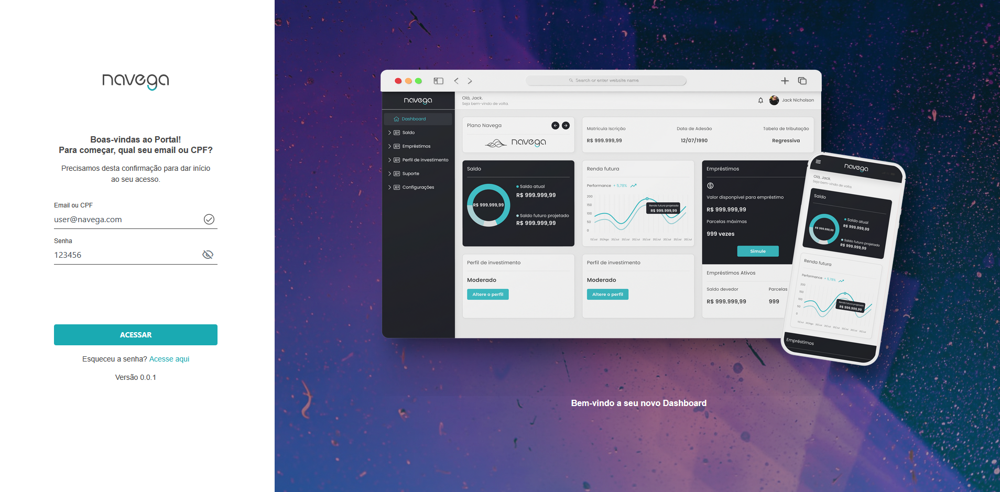
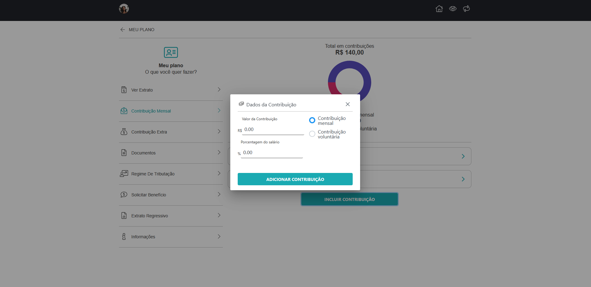
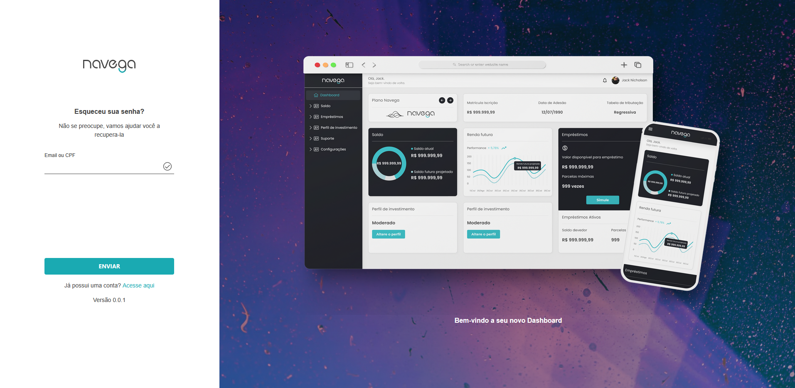
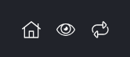

# Teste Prático - Frontend Angular

Este é o projeto desenvolvido para a etapa técnica do processo seletivo para desenvolvedor frontend. O objetivo foi construir uma aplicação Angular fiel ao protótipo disponibilizado no Figma, utilizando boas práticas de desenvolvimento, responsividade e componentização.

## 🔧 Tecnologias e Ferramentas

### Angular 14+

### PrimeNG (componentes customizados)

### LESS (pré-processador CSS)

### Chart.js (gráficos dinâmicos)

### TypeScript 100% tipado

### Jest (testes unitários)

### Gitflow (organização dos commits)

## 📦 Como rodar o projeto

### Clone o repositório:

```
git clone https://github.com/Lusques/navega-app.git

cd navega-app/
```

### Instale as dependências:

```
npm install
```

Rode a aplicação:

```
ng serve
```

Acesse no navegador:

```
http://localhost:4200
```

## 🔐 Como fazer login

O sistema de autenticação foi mockado com verificação de credenciais fixas. Para acessar o sistema, utilize os dados abaixo:

```
Email: user@navega.com
Senha: 123456
```



### 🧪 Como rodar os testes

```
npm run test
```

Observação: os testes unitários foram implementados principalmente para services e guards, com foco em lógica e segurança.

## 📱 Responsividade

O layout foi desenvolvido de forma responsiva, atendendo:

Mobile (360px+)

Tablets (768px+)

Desktop (1024px+)

```
OBS: Existe um mixin LESS responsável pelos breakpoints e os estilos no responsivo. Você pode encontrar ele no arquivo \_mixins.less
```

### 💡 Estrutura de pastas

```
src/
├── app/
│ ├── core/ # Guards, Layouts, Services
│ ├── features/ # Auth, Dashboard
│ ├── mocks/ # api mockada
│ ├── shared/ # Components, Directives, Models, Pipes
│ └── assets/ # Imagens, fontes
├── assets/
├── styles/
(...)
```

### ✅ O que foi entregue

- Fidelidade visual ao Figma (pixel perfect)

- Componentes customizados com PrimeNG

- Layout responsivo (web e mobile)

- Componentes reutilizáveis

- Código semântico em HTML

- LESS para estilização

- Tipagem com TypeScript

- Gráficos funcionais com Chart.js

- Testes com Jest (services e guards)

- Histórico de commits organizado com Gitflow

### ✨ Entrega Bônus

Modal para adicionar contribuições: Permite ao usuário adicionar contribuições diretamente na tela, com atualização em tempo real, refletindo no gráfico e no acordeão imediatamente.



Página de "Esqueci minha senha": Tela funcional adicionada ao fluxo de autenticação, com layout fiel ao estilo da aplicação.



Funcionalidades no Header:

- Home: redireciona para a tela inicial do dashboard

- Ocultar valores: alterna a exibição dos valores monetários na tela

- Resetar dados: limpa o gráfico e recarrega os dados da página



## 🤝 Agradecimentos

Agradeço pela oportunidade de participar do processo seletivo! Estou à disposição para esclarecer qualquer dúvida ou explicar melhor as decisões técnicas tomadas no projeto.
